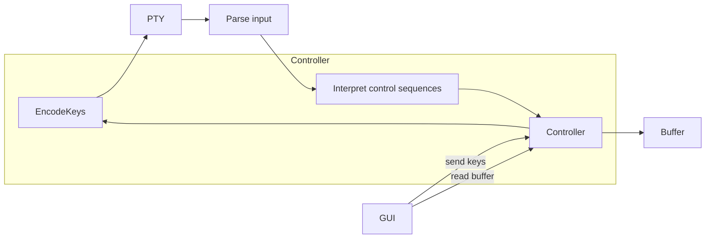

# gritty

Gritty is a terminal emulator written in Go and Gio UI Framework, focusing on readability and documentation of the code.

You could use this emulator for normal work, but I created it as a reference implementation of vt100-ish terminal emulator. (I use [kitty](https://sw.kovidgoyal.net/kitty/), and I'm happy with it. I only wanted to understand how terminals work.

Run with `go run .`, test with `go test .`.

## Architecture

### Packages

- `buffer` - Buffer is the model that contains a grid of characters, it also handles actions like "clear line" or "write rune".
- `parser` - Parser is a control-sequence parser implemented based on the [excellent state diagram by Paul Williams](https://www.vt100.net/emu/dec_ansi_parser).
- `controller` - Controller connects PTY and buffer.
  - It gives GUI the grid of runes to render and signal when to re-render.
  - It receives key events from GUI.
- `main` - Main package contains the GUI code and starts the terminal emulator.

### Code walkthrough

1. Start by understanding the [controller.Start method](https://github.com/viktomas/gritty/blob/6e545ec8c234bccabcd47d09fe3af0ee70138ebc/controller/controller.go#L31).
  - it starts the shell command and starts processing the parsed PTY operations (`c.handleOp`)
1. run the code with `gritty_debug=1 go run .` in the `main` package. This also enables extended debug logging.
1. watch the log output when you interact with the terminal and find the log statements using a full-text search.

## Resources

- [VT510 user manual - Contents](https://vt100.net/docs/vt510-rm/contents.html)
- [Digital VT100 User Guide: Programmer Information - chapter 3](https://vt100.net/docs/vt100-ug/chapter3.html)
- [asciinema/avt](https://github.com/asciinema/avt/blob/main/src/vt.rs) - extremely clear implementation of vt100-ish terminal emulator in rust
- [ANSI escape code - Wikipedia](https://en.wikipedia.org/wiki/ANSI_escape_code)
- [ASCII - Wikipedia](https://en.wikipedia.org/wiki/ASCII)
- `man ascii`
- [XtermJS - Supported Terminal Sequences](http://xtermjs.org/docs/api/vtfeatures/) - helpful overview of escape sequences
- [XTerm Control Sequences](https://invisible-island.net/xterm/ctlseqs/ctlseqs.html)
